# ERD — AI WhatsApp Business Agent + Mini CRM (Backend: NestJS)

Dokumen ini adalah Entity Relationship Diagram (ERD) yang diturunkan dari `blueprint-ai-whatsapp-business-agent.md`, disesuaikan agar mesin dapat benar-benar menjalankan alur berikut:

- Customer Service AI menjawab pelanggan sekaligus menyimpan datanya.
- Data pelanggan yang baru bertanya-tanya (belum deal) tersimpan sebagai **Lite Customer / Prospect**.
- AI aktif menjawab 24 jam (tidak tergantung jam kerja manusia).
- Data pelanggan otomatis bisa diekspor ke Excel **beserta status prosesnya** (bukan cuma file jadi, tapi ada log status export).
- Data deal (pelanggan yang sudah beli/deal) tercatat otomatis dari percakapan.
- Follow-up bisa manual maupun otomatis, lewat WhatsApp atau Email.
- Ada mekanisme **data terlarang** (sensitif) yang dideteksi, ditindak, dan di-log.
- User bisa **menandai/menentukan data pilihan** (data terpilih) untuk keperluan prioritas follow-up/export.
- HubSpot terhubung sebagai integrasi opsional, dengan status sinkronisasi per data.
- **(Baru)** User bisa **menghubungkan database eksternal miliknya sendiri**, sistem membaca daftar tabel & kolom di dalamnya, lalu user **menyeleksi tabel dan kolom** mana saja yang mau dipakai/diimpor.

> Perbedaan dari versi sebelumnya: dokumen ini menambahkan **Bagian 7** — fitur *Database Connector* (baca skema database eksternal user, seleksi tabel & kolom), lengkap dengan tabel ERD baru dan rancangan modul NestJS-nya. Bagian 6 (implementasi backend NestJS umum) tetap dipertahankan.

---

## 1. Daftar Entitas

| No | Entitas | Fungsi Utama | Referensi |
|----|---------|---------------|----------------------|
| 1 | `roles` | Daftar role (Super Admin, Admin, Business Owner, Staff/CS) | §17, §18 |
| 2 | `users` | Akun login (admin platform maupun tim bisnis) | §5, §18 |
| 3 | `businesses` | Workspace/tenant bisnis | §18 |
| 4 | `business_members` | Relasi staff/CS ke satu atau lebih business (pivot) | §17 (tambahan) |
| 5 | `ai_agents` | Konfigurasi AI Agent per business | §15, §18 |
| 6 | `knowledge_base` | Sumber pengetahuan AI (FAQ, produk, harga, dsb) | §15, §18 |
| 7 | `customers` | Data pelanggan/prospect (Lite Customer) | §8, §18 |
| 8 | `customer_status_history` | Riwayat perubahan status pelanggan | §8 (tambahan) |
| 9 | `conversations` | Sesi percakapan WhatsApp per pelanggan | §7, §14, §18 |
| 10 | `messages` | Isi pesan dalam satu conversation | §7, §18 |
| 11 | `deals` | Data pelanggan yang sudah deal/beli | §10, §18 |
| 12 | `follow_ups` | Antrian & riwayat follow-up (manual/otomatis) | §11, §18 |
| 13 | `follow_up_settings` | Aturan follow-up otomatis per business/agent | §11 (tambahan) |
| 14 | `forbidden_rules` | Definisi field/keyword/pattern data terlarang | §12, §18 |
| 15 | `forbidden_data_events` | Log kejadian saat data terlarang terdeteksi | §12 (tambahan) |
| 16 | `integrations` | Konfigurasi integrasi eksternal (HubSpot, dsb) | §13, §18 |
| 17 | `hubspot_sync_logs` | Riwayat sinkronisasi ke HubSpot per entitas | §13 (tambahan) |
| 18 | `export_jobs` | Permintaan & status export data ke Excel | §9 (tambahan) |
| 19 | `notifications` | Notifikasi dashboard (customer baru, deal, dsb) | §20 |
| 20 | `audit_logs` | Jejak audit seluruh aksi penting | §18, §21 |
| 21 | `database_connections` | Kredensial & status koneksi ke database eksternal milik user | **Baru** — fitur Database Connector |
| 22 | `db_schema_tables` | Daftar tabel hasil pembacaan skema database eksternal + status seleksi | **Baru** |
| 23 | `db_schema_columns` | Daftar kolom per tabel + status seleksi + mapping ke field internal | **Baru** |
| 24 | `db_sync_logs` | Log tiap aksi test koneksi / baca skema / import data dari database eksternal | **Baru** |

> Entitas bertanda "(tambahan)"/"Baru" tidak eksplisit digambarkan sebagai tabel di blueprint awal, tetapi dibutuhkan agar fitur yang diminta benar-benar bisa berjalan sebagai sistem, bukan cuma konsep.

---

## 2. Diagram ERD (Mermaid)

```mermaid
erDiagram
    ROLES ||--o{ USERS : "memiliki"
    USERS ||--o{ BUSINESSES : "memiliki (owner)"
    BUSINESSES ||--o{ BUSINESS_MEMBERS : "memiliki anggota"
    USERS ||--o{ BUSINESS_MEMBERS : "menjadi anggota"

    BUSINESSES ||--o{ AI_AGENTS : "memiliki"
    AI_AGENTS ||--o{ KNOWLEDGE_BASE : "menggunakan"
    BUSINESSES ||--o{ KNOWLEDGE_BASE : "memiliki"

    BUSINESSES ||--o{ CUSTOMERS : "memiliki"
    CUSTOMERS ||--o{ CUSTOMER_STATUS_HISTORY : "memiliki riwayat"

    BUSINESSES ||--o{ CONVERSATIONS : "memiliki"
    CUSTOMERS ||--o{ CONVERSATIONS : "melakukan"
    AI_AGENTS ||--o{ CONVERSATIONS : "menangani"
    CONVERSATIONS ||--o{ MESSAGES : "berisi"

    BUSINESSES ||--o{ DEALS : "memiliki"
    CUSTOMERS ||--o{ DEALS : "menghasilkan"
    CONVERSATIONS ||--o| DEALS : "memicu (opsional)"
    USERS ||--o{ DEALS : "mengonfirmasi (sales/CS)"

    BUSINESSES ||--o{ FOLLOW_UPS : "memiliki"
    CUSTOMERS ||--o{ FOLLOW_UPS : "menerima"
    USERS ||--o{ FOLLOW_UPS : "membuat (manual)"
    BUSINESSES ||--o{ FOLLOW_UP_SETTINGS : "mengatur"
    AI_AGENTS ||--o{ FOLLOW_UP_SETTINGS : "menerapkan"

    BUSINESSES ||--o{ FORBIDDEN_RULES : "menentukan"
    FORBIDDEN_RULES ||--o{ FORBIDDEN_DATA_EVENTS : "mendeteksi"
    CUSTOMERS ||--o{ FORBIDDEN_DATA_EVENTS : "terkait"
    CONVERSATIONS ||--o{ FORBIDDEN_DATA_EVENTS : "memicu"

    BUSINESSES ||--o{ INTEGRATIONS : "memiliki"
    INTEGRATIONS ||--o{ HUBSPOT_SYNC_LOGS : "mencatat"
    CUSTOMERS ||--o{ HUBSPOT_SYNC_LOGS : "disinkronkan"
    DEALS ||--o{ HUBSPOT_SYNC_LOGS : "disinkronkan"

    BUSINESSES ||--o{ EXPORT_JOBS : "meminta"
    USERS ||--o{ EXPORT_JOBS : "meminta"

    BUSINESSES ||--o{ NOTIFICATIONS : "menerima"
    USERS ||--o{ NOTIFICATIONS : "menerima"

    BUSINESSES ||--o{ AUDIT_LOGS : "mencatat"
    USERS ||--o{ AUDIT_LOGS : "melakukan aksi"

    BUSINESSES ||--o{ DATABASE_CONNECTIONS : "memiliki"
    USERS ||--o{ DATABASE_CONNECTIONS : "membuat"
    DATABASE_CONNECTIONS ||--o{ DB_SCHEMA_TABLES : "memiliki tabel"
    DB_SCHEMA_TABLES ||--o{ DB_SCHEMA_COLUMNS : "memiliki kolom"
    DATABASE_CONNECTIONS ||--o{ DB_SYNC_LOGS : "mencatat aktivitas"

    ROLES {
        int id PK
        string name
    }

    USERS {
        int id PK
        string name
        string email
        string password_hash
        int role_id FK
        string status
        datetime created_at
        datetime updated_at
    }

    BUSINESSES {
        int id PK
        int owner_id FK
        string name
        string description
        string status
        datetime created_at
        datetime updated_at
    }

    BUSINESS_MEMBERS {
        int id PK
        int business_id FK
        int user_id FK
        int role_id FK
        string status
        datetime created_at
    }

    AI_AGENTS {
        int id PK
        int business_id FK
        string name
        text system_prompt
        string personality
        string operating_hours
        string status
        datetime created_at
        datetime updated_at
    }

    KNOWLEDGE_BASE {
        int id PK
        int business_id FK
        int ai_agent_id FK
        string title
        text content
        string source_type
        datetime created_at
    }

    CUSTOMERS {
        int id PK
        int business_id FK
        string name
        string whatsapp
        string email
        string company
        string product_interest
        text needs
        string status
        string source
        boolean is_selected
        datetime last_conversation_at
        datetime last_contact_at
        datetime created_at
        datetime updated_at
    }

    CUSTOMER_STATUS_HISTORY {
        int id PK
        int customer_id FK
        string previous_status
        string new_status
        string changed_by
        datetime changed_at
    }

    CONVERSATIONS {
        int id PK
        int business_id FK
        int customer_id FK
        int ai_agent_id FK
        string channel
        string status
        int assigned_to FK
        datetime created_at
        datetime updated_at
    }

    MESSAGES {
        int id PK
        int conversation_id FK
        string sender_type
        text message
        boolean ai_generated
        datetime created_at
    }

    DEALS {
        int id PK
        int business_id FK
        int customer_id FK
        int conversation_id FK
        int handled_by FK
        string product
        int quantity
        decimal amount
        string payment_status
        string status
        date deal_date
        text notes
        string source
        datetime created_at
        datetime updated_at
    }

    FOLLOW_UPS {
        int id PK
        int business_id FK
        int customer_id FK
        int created_by FK
        string type
        string channel
        datetime scheduled_at
        text message
        string status
        datetime sent_at
        datetime replied_at
        datetime created_at
    }

    FOLLOW_UP_SETTINGS {
        int id PK
        int business_id FK
        int ai_agent_id FK
        int max_follow_up
        int interval_hours
        string send_time_start
        string send_time_end
        string send_days
        text default_template
        text stop_conditions
        datetime created_at
        datetime updated_at
    }

    FORBIDDEN_RULES {
        int id PK
        int business_id FK
        string name
        string rule_type
        string pattern
        string action
        boolean active
        string retention_policy
        datetime created_at
    }

    FORBIDDEN_DATA_EVENTS {
        int id PK
        int business_id FK
        int forbidden_rule_id FK
        int customer_id FK
        int conversation_id FK
        string detected_value_masked
        string action_taken
        datetime created_at
    }

    INTEGRATIONS {
        int id PK
        int business_id FK
        string provider
        string access_token_encrypted
        string status
        text config
        datetime created_at
        datetime updated_at
    }

    HUBSPOT_SYNC_LOGS {
        int id PK
        int integration_id FK
        string entity_type
        int entity_id
        string sync_status
        text error_message
        datetime synced_at
    }

    EXPORT_JOBS {
        int id PK
        int business_id FK
        int requested_by FK
        text filter
        string file_path
        string status
        datetime created_at
        datetime completed_at
    }

    NOTIFICATIONS {
        int id PK
        int business_id FK
        int user_id FK
        string type
        string message
        boolean is_read
        datetime created_at
    }

    AUDIT_LOGS {
        int id PK
        int business_id FK
        int user_id FK
        string action
        string entity
        int entity_id
        text metadata
        datetime created_at
    }

    DATABASE_CONNECTIONS {
        int id PK
        int business_id FK
        int created_by FK
        string name
        string db_type
        string host
        int port
        string database_name
        string username
        string password_encrypted
        boolean ssl_enabled
        string status
        datetime last_tested_at
        datetime last_synced_at
        datetime created_at
        datetime updated_at
    }

    DB_SCHEMA_TABLES {
        int id PK
        int connection_id FK
        string table_name
        string table_label
        bigint row_count_estimate
        boolean is_selected
        datetime synced_at
    }

    DB_SCHEMA_COLUMNS {
        int id PK
        int table_id FK
        string column_name
        string data_type
        boolean is_nullable
        boolean is_primary_key
        boolean is_selected
        string mapped_field
        datetime synced_at
    }

    DB_SYNC_LOGS {
        int id PK
        int connection_id FK
        string action
        string status
        text message
        datetime created_at
    }
```



---

## 3. Penjelasan Entitas & Pemetaan ke Kebutuhan

### 3.1 Customer Service (jawab & simpan data)
- `conversations` + `messages` menyimpan seluruh histori chat WhatsApp.
- `ai_agents` menangani percakapan (`ai_agent_id` di `conversations`) sehingga AI bisa membalas kapan saja tanpa bergantung jam kerja manusia (24 jam), karena tidak ada relasi wajib ke `users` untuk membalas — hanya butuh `assigned_to` saat terjadi human handoff.
- Field `ai_generated` di `messages` membedakan balasan AI vs manusia.

### 3.2 Data Pelanggan / Lite (belum deal)
- Tabel `customers` menyimpan pelanggan sejak status `NEW` sampai `DEAL`.
- `customer_status_history` mencatat perjalanan status (`NEW → CONTACTED → INTERESTED → QUALIFIED → NEGOTIATION → DEAL`).
- Kolom `is_selected` pada `customers` memenuhi kebutuhan **"bisa menentukan data terpilih"**.

### 3.3 Export Excel otomatis dengan status
- `export_jobs` menyimpan permintaan export, lalu `status` berjalan `PENDING → PROCESSING → DONE/FAILED`, dan `file_path` menyimpan lokasi file hasil.

### 3.4 Data Deal otomatis
- `deals` terhubung ke `customers` dan opsional ke `conversations` sebagai bukti sumber percakapan yang memicu deal, dengan status `PENDING → CONFIRMED → PAID → COMPLETED`.

### 3.5 Follow Up (manual & otomatis, WA/Email)
- `follow_ups` menampung follow-up manual maupun otomatis, dengan `channel` = WhatsApp/Email dan `status` mengikuti alur `SCHEDULED → SENT → DELIVERED → REPLIED/FAILED/CANCELLED`.
- `follow_up_settings` menyimpan aturan otomatisasi per business/agent.

### 3.6 Data Terlarang
- `forbidden_rules` menyimpan definisi field/keyword/pattern terlarang; `forbidden_data_events` mencatat setiap kejadian terdeteksi beserta tindakannya.

### 3.7 Data Terpilih
- Kolom `is_selected` pada `customers`, plus filter di `export_jobs.filter`, dipakai untuk menyaring data prioritas sebelum di-export/follow-up. Pola "seleksi" yang sama juga dipakai pada fitur baru di Bagian 3.9 (seleksi tabel & kolom database eksternal).

### 3.8 HubSpot (opsional)
- `integrations` + `hubspot_sync_logs` mencatat konfigurasi dan status sinkronisasi (`SYNCED/PENDING/FAILED`) tanpa membuat alur inti bergantung padanya.

### 3.9 Koneksi & Seleksi Database Eksternal (Baru)
- `database_connections` menyimpan kredensial database milik user (host, port, nama database, username, password terenkripsi, jenis DB) beserta `status` (`TESTING/CONNECTED/FAILED/DISCONNECTED`).
- Saat koneksi berhasil, sistem membaca metadata skema (`information_schema` untuk MySQL/PostgreSQL) dan menyimpan **setiap tabel** yang ditemukan ke `db_schema_tables`, lengkap dengan estimasi jumlah baris (`row_count_estimate`).
- Untuk setiap tabel, sistem membaca **seluruh kolomnya** dan menyimpan ke `db_schema_columns` (nama kolom, tipe data, nullable, primary key).
- User lalu **menyeleksi** tabel mana yang relevan (`db_schema_tables.is_selected`) dan **menyeleksi kolom** mana saja di dalam tabel tersebut (`db_schema_columns.is_selected`) — inilah pemenuhan kebutuhan *"bisa membaca tabel yang berada di database user dan bisa diseleksi tabelnya, begitu juga kolomnya"*.
- Kolom `mapped_field` pada `db_schema_columns` bersifat opsional: dipakai bila user ingin memetakan kolom terpilih (mis. kolom `nama_pelanggan`) ke field internal CRM (`customers.name`), sehingga data dari database eksternal bisa langsung diimpor menjadi data `customers` tanpa mapping manual berulang.
- `db_sync_logs` mencatat setiap aksi (`TEST_CONNECTION`, `FETCH_SCHEMA`, `IMPORT_DATA`) beserta status dan pesan error jika gagal — supaya proses baca skema yang bisa berjalan lama (database besar) tetap terlihat progresnya di dashboard, konsisten dengan pola `export_jobs` di §3.3.

---

## 4. Relasi Kunci (Ringkasan)

- `businesses` adalah pusat multi-tenant: hampir semua entitas operasional memiliki `business_id`, termasuk `database_connections`.
- `customers` adalah pusat data pelanggan: satu customer bisa punya banyak `conversations`, `deals`, `follow_ups`, `customer_status_history`.
- `conversations` menjembatani chat mentah (`messages`) dan hasil bisnis (`deals`, `forbidden_data_events`).
- `follow_up_settings` dan `forbidden_rules` adalah tabel "aturan" (configuration); `follow_ups` dan `forbidden_data_events` adalah tabel "kejadian" (transaksional) hasil penerapan aturan.
- `database_connections → db_schema_tables → db_schema_columns` membentuk hierarki 3 level (koneksi → tabel → kolom) yang mencerminkan struktur database eksternal user secara nyata; `db_sync_logs` berperan sebagai jejak proses (mirip `export_jobs`) agar user tahu kapan skema terakhir dibaca dan apakah berhasil.

---

## 5. Catatan Implementasi Umum

- Semua timestamp disarankan disimpan dalam UTC.
- `access_token_encrypted` (integrations) dan `password_encrypted` (database_connections) wajib dienkripsi (bukan plain text).
- Tambahkan index pada kombinasi `business_id + status` di tabel `customers`, `deals`, `follow_ups`, dan `connection_id + is_selected` di `db_schema_tables`/`db_schema_columns` karena kolom ini paling sering difilter di UI seleksi.
- ERD ini masih bisa berkembang di fase lanjutan (mis. tabel `subscriptions`/`billing`), tetapi struktur di atas sudah cukup untuk menjalankan seluruh MVP.

---

## 6. Implementasi Backend dengan NestJS (Umum)

### 6.1 Stack Backend yang Disarankan

| Kebutuhan | Package NestJS |
|---|---|
| ORM ke MySQL (database internal aplikasi) | `@nestjs/typeorm` + `typeorm` (atau Prisma) |
| Autentikasi | `@nestjs/jwt`, `@nestjs/passport`, `passport-jwt`, `bcrypt` |
| RBAC | Custom `Guard` + `Decorator` (`@Roles()`) berbasis `roles` & `business_members` |
| Validasi DTO | `class-validator`, `class-transformer` |
| Scheduler (follow-up otomatis) | `@nestjs/schedule` (cron job) |
| Queue/background job (export, follow-up, sync HubSpot, baca skema DB eksternal) | `@nestjs/bullmq` + Redis |
| Webhook WhatsApp | Modul `whatsapp` dengan endpoint publik + verifikasi signature |
| Export Excel | `exceljs` |
| Email | `@nestjs-modules/mailer` atau provider (SendGrid/SMTP) |
| Enkripsi kredensial | `@nestjs/config` + `crypto` (AES-256) |
| Driver database eksternal (dinamis, lihat Bagian 7) | `mysql2`, `pg`, `mssql`, `tedious` (sesuai `db_type` yang didukung) |
| Dokumentasi API | `@nestjs/swagger` |

### 6.2 Struktur Folder Modul

```text
src/
├── main.ts
├── app.module.ts
├── config/
│   └── database.config.ts
├── common/
│   ├── guards/          # JwtAuthGuard, RolesGuard
│   ├── decorators/      # @Roles(), @CurrentBusiness()
│   ├── interceptors/    # audit-log.interceptor.ts
│   └── filters/         # http-exception.filter.ts
│
├── modules/
│   ├── auth/
│   ├── users/
│   ├── businesses/
│   ├── ai-agents/
│   ├── customers/
│   ├── conversations/
│   ├── whatsapp/
│   ├── deals/
│   ├── follow-ups/
│   ├── forbidden-data/
│   ├── integrations/
│   │   └── hubspot/
│   ├── export/
│   ├── notifications/
│   ├── audit-logs/
│   ├── database-connector/    # ← modul baru, lihat Bagian 7
│   └── admin/
│
└── database/
    ├── entities/
    └── migrations/
```

### 6.3–6.7
*(Sama seperti draft sebelumnya: mapping entity TypeORM, background job table, RBAC, endpoint mengikuti API blueprint, dan catatan environment/Redis. Lihat Bagian 7 untuk detail modul baru.)*

---

## 7. Fitur Baru: Database Connector (Baca & Seleksi Tabel/Kolom Database User)

Fitur ini memungkinkan user menghubungkan database miliknya sendiri (MySQL/PostgreSQL/SQL Server, dsb), lalu sistem **membaca metadata skema** (bukan seluruh data) untuk ditampilkan sebagai daftar tabel → daftar kolom yang bisa **diseleksi** satu per satu.

### 7.1 Alur Pengguna (User Flow)

1. **Connect** — User mengisi form koneksi: jenis database, host, port, nama database, username, password (opsional SSL).
2. **Test Connection** — Backend mencoba konek singkat (timeout pendek) → hasil disimpan ke `database_connections.status` + dicatat di `db_sync_logs` (`action = TEST_CONNECTION`).
3. **Fetch Schema** — Setelah koneksi berhasil, backend membaca daftar tabel via `information_schema.tables` dan daftar kolom via `information_schema.columns` (read-only, tanpa mengeksekusi query ke data asli) → disimpan ke `db_schema_tables` dan `db_schema_columns`.
4. **Pilih Tabel** — User melihat daftar tabel di UI (checklist), menandai tabel mana yang relevan → update `db_schema_tables.is_selected`.
5. **Pilih Kolom** — Untuk setiap tabel terpilih, user melihat daftar kolomnya dan menandai kolom mana yang mau dipakai → update `db_schema_columns.is_selected`.
6. **(Opsional) Mapping & Import** — User memetakan kolom terpilih ke field CRM (`name`, `whatsapp`, `email`, dst) lalu memicu job import; hasilnya jadi baris baru di `customers` (mengikuti pola `export_jobs`/`import_jobs` dengan status `PENDING → PROCESSING → DONE/FAILED`, dicatat di `db_sync_logs` dengan `action = IMPORT_DATA`).

### 7.2 Modul NestJS: `database-connector`

```text
modules/database-connector/
├── database-connector.module.ts
├── database-connector.controller.ts
├── database-connector.service.ts
├── dto/
│   ├── create-connection.dto.ts
│   ├── select-tables.dto.ts
│   ├── select-columns.dto.ts
│   └── import-data.dto.ts
├── drivers/
│   ├── driver.factory.ts        # pilih driver sesuai db_type
│   ├── mysql.introspector.ts
│   ├── postgres.introspector.ts
│   └── mssql.introspector.ts
└── processors/
    ├── fetch-schema.processor.ts   # BullMQ job: baca tabel & kolom
    └── import-data.processor.ts    # BullMQ job: import data terpilih
```

### 7.3 Endpoint API

```text
POST   /database-connections                 → simpan kredensial (password langsung dienkripsi)
POST   /database-connections/:id/test         → test koneksi, update status
POST   /database-connections/:id/fetch-schema → trigger job baca skema (queue)
GET    /database-connections/:id/tables       → daftar tabel hasil baca skema
PATCH  /database-connections/:id/tables       → update seleksi tabel (bulk: array {id, is_selected})
GET    /database-connections/:id/tables/:tableId/columns  → daftar kolom suatu tabel
PATCH  /database-connections/:id/tables/:tableId/columns  → update seleksi kolom (bulk)
POST   /database-connections/:id/import       → trigger job import data dari tabel/kolom terpilih
GET    /database-connections/:id/logs         → riwayat aktivitas (db_sync_logs)
DELETE /database-connections/:id              → hapus koneksi (+ cascade tabel/kolom terkait)
```

### 7.4 Contoh Introspeksi Skema (MySQL, read-only)

```typescript
// modules/database-connector/drivers/mysql.introspector.ts
import { createConnection } from 'mysql2/promise';

export async function introspectMysqlSchema(config: {
  host: string; port: number; user: string; password: string; database: string;
}) {
  const conn = await createConnection({ ...config, connectTimeout: 5000 });

  try {
    const [tables] = await conn.query(
      `SELECT TABLE_NAME, TABLE_ROWS
       FROM information_schema.tables
       WHERE TABLE_SCHEMA = ?`,
      [config.database],
    );

    const [columns] = await conn.query(
      `SELECT TABLE_NAME, COLUMN_NAME, DATA_TYPE, IS_NULLABLE, COLUMN_KEY
       FROM information_schema.columns
       WHERE TABLE_SCHEMA = ?`,
      [config.database],
    );

    return { tables, columns };
  } finally {
    await conn.end(); // koneksi selalu ditutup setelah introspeksi, tidak dibiarkan menggantung
  }
}
```

`driver.factory.ts` memilih introspector yang sesuai berdasarkan `database_connections.db_type` (`mysql`, `postgres`, `mssql`, dst), sehingga service utama tidak perlu tahu detail tiap driver.

### 7.5 TypeORM Entity Baru

```typescript
// database/entities/database-connection.entity.ts
import {
  Entity, PrimaryGeneratedColumn, Column,
  ManyToOne, OneToMany, CreateDateColumn, UpdateDateColumn,
} from 'typeorm';
import { Business } from './business.entity';
import { User } from './user.entity';
import { DbSchemaTable } from './db-schema-table.entity';

export enum DbConnectionStatus {
  TESTING = 'TESTING',
  CONNECTED = 'CONNECTED',
  FAILED = 'FAILED',
  DISCONNECTED = 'DISCONNECTED',
}

@Entity('database_connections')
export class DatabaseConnection {
  @PrimaryGeneratedColumn() id: number;

  @ManyToOne(() => Business) business: Business;
  @ManyToOne(() => User) createdBy: User;

  @Column() name: string;
  @Column({ name: 'db_type' }) dbType: string; // mysql | postgres | mssql
  @Column() host: string;
  @Column() port: number;
  @Column({ name: 'database_name' }) databaseName: string;
  @Column() username: string;
  @Column({ name: 'password_encrypted' }) passwordEncrypted: string;
  @Column({ name: 'ssl_enabled', default: false }) sslEnabled: boolean;

  @Column({ type: 'enum', enum: DbConnectionStatus, default: DbConnectionStatus.TESTING })
  status: DbConnectionStatus;

  @Column({ name: 'last_tested_at', nullable: true }) lastTestedAt: Date;
  @Column({ name: 'last_synced_at', nullable: true }) lastSyncedAt: Date;

  @OneToMany(() => DbSchemaTable, (t) => t.connection) tables: DbSchemaTable[];

  @CreateDateColumn({ name: 'created_at' }) createdAt: Date;
  @UpdateDateColumn({ name: 'updated_at' }) updatedAt: Date;
}
```

```typescript
// database/entities/db-schema-table.entity.ts
import {
  Entity, PrimaryGeneratedColumn, Column,
  ManyToOne, OneToMany,
} from 'typeorm';
import { DatabaseConnection } from './database-connection.entity';
import { DbSchemaColumn } from './db-schema-column.entity';

@Entity('db_schema_tables')
export class DbSchemaTable {
  @PrimaryGeneratedColumn() id: number;

  @ManyToOne(() => DatabaseConnection, (c) => c.tables)
  connection: DatabaseConnection;

  @Column({ name: 'table_name' }) tableName: string;
  @Column({ name: 'table_label', nullable: true }) tableLabel: string;
  @Column({ name: 'row_count_estimate', type: 'bigint', nullable: true })
  rowCountEstimate: number;
  @Column({ name: 'is_selected', default: false }) isSelected: boolean;
  @Column({ name: 'synced_at' }) syncedAt: Date;

  @OneToMany(() => DbSchemaColumn, (c) => c.table) columns: DbSchemaColumn[];
}
```

```typescript
// database/entities/db-schema-column.entity.ts
import { Entity, PrimaryGeneratedColumn, Column, ManyToOne } from 'typeorm';
import { DbSchemaTable } from './db-schema-table.entity';

@Entity('db_schema_columns')
export class DbSchemaColumn {
  @PrimaryGeneratedColumn() id: number;

  @ManyToOne(() => DbSchemaTable, (t) => t.columns)
  table: DbSchemaTable;

  @Column({ name: 'column_name' }) columnName: string;
  @Column({ name: 'data_type' }) dataType: string;
  @Column({ name: 'is_nullable', default: true }) isNullable: boolean;
  @Column({ name: 'is_primary_key', default: false }) isPrimaryKey: boolean;
  @Column({ name: 'is_selected', default: false }) isSelected: boolean;
  @Column({ name: 'mapped_field', nullable: true }) mappedField: string; // mis. 'customers.name'
  @Column({ name: 'synced_at' }) syncedAt: Date;
}
```

### 7.6 Catatan Keamanan Khusus Fitur Ini (penting)

- **Gunakan akun database read-only.** Sarankan ke user agar membuat user database khusus dengan hak akses `SELECT` saja (idealnya hanya ke `information_schema` + tabel yang mau dibaca), bukan akun admin/root.
- **Password selalu dienkripsi** (AES-256) sebelum disimpan ke `database_connections.password_encrypted`, dan hanya didekripsi sesaat di memory saat proses koneksi berjalan.
- **Batasi waktu koneksi** (`connectTimeout`) dan **selalu tutup koneksi** (`conn.end()`) setelah proses introspeksi/import selesai, agar tidak ada koneksi menggantung ke database user.
- **Jangan pernah membangun query dari input bebas.** Nama tabel/kolom yang dipilih user untuk proses import harus divalidasi terhadap daftar yang sudah tersimpan di `db_schema_tables`/`db_schema_columns` (bukan string mentah dari request), untuk mencegah SQL injection.
- **Proses baca skema & import dijalankan sebagai background job** (`BullMQ`) via `fetch-schema.processor.ts` / `import-data.processor.ts`, bukan langsung di request HTTP, karena database user bisa besar dan lambat direspons.
- **Audit trail** — setiap test koneksi, fetch schema, dan import data dicatat di `db_sync_logs` dan juga `audit_logs`, sesuai prinsip keamanan di §21 blueprint awal.