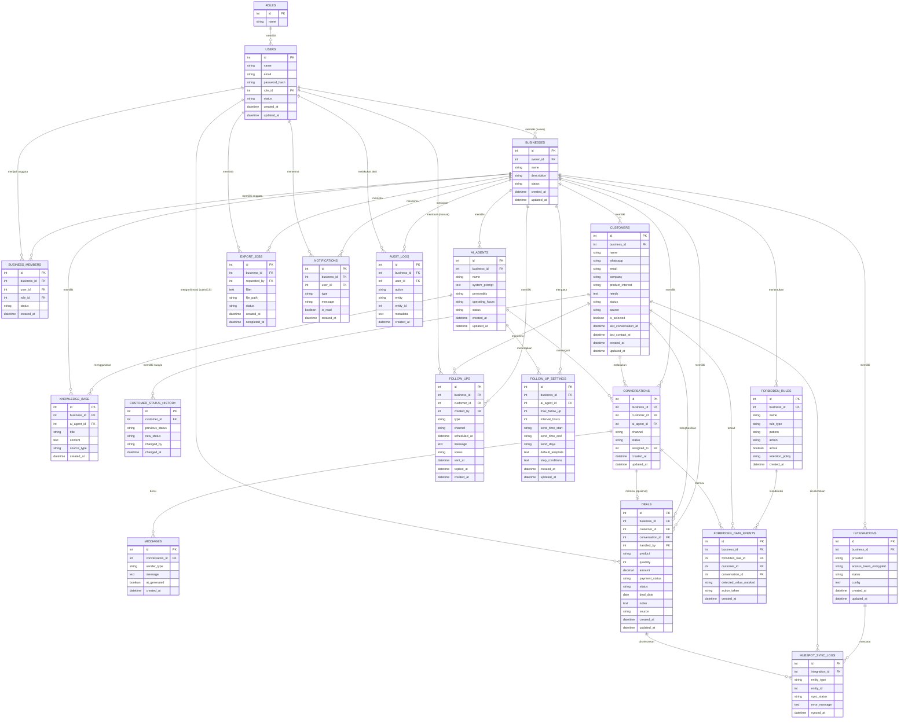

# ERD — AI WhatsApp Business Agent + Mini CRM (Backend: NestJS)

Dokumen ini adalah Entity Relationship Diagram (ERD) yang diturunkan dari `blueprint-ai-whatsapp-business-agent.md`, disesuaikan agar mesin dapat benar-benar menjalankan alur berikut:

- Customer Service AI menjawab pelanggan sekaligus menyimpan datanya.
- Data pelanggan yang baru bertanya-tanya (belum deal) tersimpan sebagai **Lite Customer / Prospect**.
- AI aktif menjawab 24 jam (tidak tergantung jam kerja manusia).
- Data pelanggan otomatis bisa diekspor ke Excel **beserta status prosesnya** (bukan cuma file jadi, tapi ada log status export).
- Data deal (pelanggan yang sudah beli/deal) tercatat otomatis dari percakapan.
- Follow-up bisa manual maupun otomatis, lewat WhatsApp atau Email.
- Ada mekanisme **data terlarang** (sensitif) yang dideteksi, ditindak, dan di-log.
- User bisa **menandai/menentukan data pilihan** (data terpilih) untuk keperluan prioritas follow-up/export.
- HubSpot terhubung sebagai integrasi opsional, dengan status sinkronisasi per data.

> Perbedaan dari versi sebelumnya (`erd.md`): dokumen ini menambahkan **Bagian 6** yang memetakan seluruh ERD ke struktur backend **NestJS** secara konkret (module, service, entity/ORM, queue, scheduler), sesuai arahan blueprint §28 yang merekomendasikan **NestJS sebagai backend**.

---

## 1. Daftar Entitas

| No | Entitas | Fungsi Utama | Referensi Blueprint |
|----|---------|---------------|----------------------|
| 1 | `roles` | Daftar role (Super Admin, Admin, Business Owner, Staff/CS) | §17, §18 |
| 2 | `users` | Akun login (admin platform maupun tim bisnis) | §5, §18 |
| 3 | `businesses` | Workspace/tenant bisnis | §18 |
| 4 | `business_members` | Relasi staff/CS ke satu atau lebih business (pivot) | §17 (tambahan agar role Staff/CS bisa terpasang ke business) |
| 5 | `ai_agents` | Konfigurasi AI Agent per business | §15, §18 |
| 6 | `knowledge_base` | Sumber pengetahuan AI (FAQ, produk, harga, dsb) | §15, §18 |
| 7 | `customers` | Data pelanggan/prospect (Lite Customer) | §8, §18 |
| 8 | `customer_status_history` | Riwayat perubahan status pelanggan | §8 (tambahan untuk audit funnel status) |
| 9 | `conversations` | Sesi percakapan WhatsApp per pelanggan | §7, §14, §18 |
| 10 | `messages` | Isi pesan dalam satu conversation | §7, §18 |
| 11 | `deals` | Data pelanggan yang sudah deal/beli | §10, §18 |
| 12 | `follow_ups` | Antrian & riwayat follow-up (manual/otomatis) | §11, §18 |
| 13 | `follow_up_settings` | Aturan follow-up otomatis per business/agent | §11 (tambahan, menampung field settings di §11) |
| 14 | `forbidden_rules` | Definisi field/keyword/pattern data terlarang | §12, §18 |
| 15 | `forbidden_data_events` | Log kejadian saat data terlarang terdeteksi | §12 (tambahan, menampung "Log event" di §12) |
| 16 | `integrations` | Konfigurasi integrasi eksternal (HubSpot, dsb) | §13, §18 |
| 17 | `hubspot_sync_logs` | Riwayat sinkronisasi ke HubSpot per entitas | §13 (tambahan untuk status SYNCED/PENDING/FAILED) |
| 18 | `export_jobs` | Permintaan & status export data ke Excel | §9 (tambahan agar export "memberikan status") |
| 19 | `notifications` | Notifikasi dashboard (customer baru, deal, dsb) | §20 |
| 20 | `audit_logs` | Jejak audit seluruh aksi penting | §18, §21 |

> Entitas bertanda "(tambahan)" tidak eksplisit digambarkan sebagai tabel di blueprint, tetapi dibutuhkan agar fitur yang diminta (status export, log data terlarang, status sync HubSpot, aturan follow-up) benar-benar bisa berjalan sebagai sistem, bukan cuma konsep.

---

## 2. Diagram ERD (Mermaid)



---

## 3. Penjelasan Entitas & Pemetaan ke Kebutuhan

### 3.1 Customer Service (jawab & simpan data)
- `conversations` + `messages` menyimpan seluruh histori chat WhatsApp.
- `ai_agents` menangani percakapan (`ai_agent_id` di `conversations`) sehingga AI bisa membalas kapan saja tanpa bergantung jam kerja manusia (24 jam), karena tidak ada relasi wajib ke `users` untuk membalas — hanya butuh `assigned_to` saat terjadi human handoff.
- Field `ai_generated` di `messages` membedakan balasan AI vs manusia.

### 3.2 Data Pelanggan / Lite (belum deal)
- Tabel `customers` menyimpan pelanggan sejak status `NEW` sampai `DEAL`.
- `customer_status_history` mencatat perjalanan status (`NEW → CONTACTED → INTERESTED → QUALIFIED → NEGOTIATION → DEAL`) — ini penyelesaian untuk "masalah utama pabrik" yaitu data prospek yang sering hilang/tidak terlacak.
- Kolom `is_selected` pada `customers` memenuhi kebutuhan **"bisa menentukan data terpilih"** — user/CS bisa menandai pelanggan prioritas (misalnya untuk difollow-up lebih dulu atau di-export terpisah).

### 3.3 Export Excel otomatis dengan status
- `export_jobs` menyimpan permintaan export (filter status/tanggal/produk/sumber sesuai §9), lalu `status` berjalan `PENDING → PROCESSING → DONE/FAILED`, dan `file_path` menyimpan lokasi file hasil.
- Dengan tabel ini, proses export tidak sekadar "generate file" tapi punya jejak status yang bisa dipantau di dashboard (sesuai permintaan "memberikan status").

### 3.4 Data Deal otomatis
- `deals` terhubung ke `customers` dan opsional ke `conversations` (`conversation_id`) sebagai bukti sumber percakapan yang memicu deal.
- Saat AI mendeteksi indikasi deal, sistem membuat baris baru di `deals` dengan status `PENDING`, lalu bisa dikonfirmasi manusia (`handled_by`) sebelum menjadi `CONFIRMED → PAID → COMPLETED`, sesuai catatan blueprint bahwa deal penting butuh konfirmasi manusia.

### 3.5 Follow Up (manual & otomatis, WA/Email)
- `follow_ups` menampung baik follow-up manual (`created_by` diisi user) maupun otomatis (`created_by` null/system), dengan `channel` = WhatsApp atau Email, dan `status` mengikuti alur `SCHEDULED → SENT → DELIVERED → REPLIED/FAILED/CANCELLED`.
- `follow_up_settings` menyimpan aturan otomatisasi per business/agent: jumlah maksimal follow-up, jeda antar follow-up, jam & hari kirim, template default, dan kondisi berhenti (`stop_conditions`) — sesuai daftar "Safety/Business Rules" di §11.

### 3.6 Data Terlarang
- `forbidden_rules` menyimpan definisi field/keyword/pattern yang tidak boleh diproses (mis. NIK, nomor kartu, password).
- `forbidden_data_events` mencatat setiap kali AI mendeteksi data tersebut dalam suatu `conversation`, termasuk `action_taken` (mask/block) — inilah "Log event" yang disebut di §12, sekaligus jadi bahan audit kepatuhan privasi.

### 3.7 Data Terpilih
- Selain kolom `is_selected` pada `customers`, mekanisme filter di `export_jobs.filter` dan status di `customer_status_history` juga bisa dipakai untuk menyaring "data terpilih" (misalnya hanya status `QUALIFIED` + `is_selected = true`) sebelum di-export atau di-follow-up.

### 3.8 HubSpot (opsional)
- `integrations` menyimpan konfigurasi koneksi HubSpot per business (token terenkripsi, status connect/disconnect).
- `hubspot_sync_logs` mencatat status sinkronisasi per entitas (`customer` atau `deal`) dengan `sync_status` = `SYNCED / PENDING / FAILED`, sesuai §13.
- Karena integrasi ini opsional, seluruh alur inti (CS, data pelanggan, deal, follow-up) tetap berjalan penuh tanpa bergantung pada `integrations`/`hubspot_sync_logs`.

---

## 4. Relasi Kunci (Ringkasan)

- `businesses` adalah pusat multi-tenant: hampir semua entitas operasional (`customers`, `conversations`, `deals`, `follow_ups`, `forbidden_rules`, `integrations`, `ai_agents`, `export_jobs`) memiliki `business_id`.
- `customers` adalah pusat data pelanggan: satu customer bisa punya banyak `conversations`, banyak `deals` (jarang, tapi mungkin repeat order), banyak `follow_ups`, dan banyak `customer_status_history`.
- `conversations` menjadi jembatan antara chat mentah (`messages`) dan hasil bisnis (`deals`, `forbidden_data_events`).
- `follow_up_settings` dan `forbidden_rules` adalah tabel "aturan" (configuration) yang dipakai sistem untuk mengambil keputusan otomatis, sedangkan `follow_ups` dan `forbidden_data_events` adalah tabel "kejadian" (transaksional) hasil penerapan aturan tersebut.

---

## 5. Catatan Implementasi Umum

- Semua timestamp disarankan disimpan dalam UTC agar konsisten dengan operasional 24 jam lintas zona waktu.
- `access_token_encrypted` pada `integrations` wajib dienkripsi (bukan plain text), sesuai §21 Security.
- Sebaiknya tambahkan index pada kombinasi `business_id + status` di tabel `customers`, `deals`, dan `follow_ups` karena kolom ini paling sering difilter di dashboard maupun saat export.
- ERD ini masih bisa berkembang di fase lanjutan (mis. tabel `subscriptions`/`billing` bila platform ini nantinya SaaS berbayar), tetapi struktur di atas sudah cukup untuk menjalankan seluruh MVP Phase 1–8 pada blueprint.

---

## 6. Implementasi Backend dengan NestJS

Bagian ini memetakan ERD di atas menjadi struktur project **NestJS** yang siap dikembangkan, sesuai rekomendasi arsitektur di blueprint §28 (`Backend → NestJS`, `Database → MySQL`).

### 6.1 Stack Backend yang Disarankan

| Kebutuhan | Package NestJS |
|---|---|
| ORM ke MySQL | `@nestjs/typeorm` + `typeorm` (atau Prisma bila tim lebih familiar) |
| Autentikasi | `@nestjs/jwt`, `@nestjs/passport`, `passport-jwt`, `bcrypt` |
| RBAC (role-based access) | Custom `Guard` + `Decorator` (`@Roles()`) berbasis `roles` & `business_members` |
| Validasi DTO | `class-validator`, `class-transformer` |
| Scheduler (follow-up otomatis 24/48 jam, 7 hari) | `@nestjs/schedule` (cron job) |
| Queue/background job (export Excel, kirim WA/Email, sync HubSpot) | `@nestjs/bullmq` + Redis |
| Webhook WhatsApp | Modul `whatsapp` dengan endpoint publik + verifikasi signature |
| Export Excel | `exceljs` dijalankan di dalam job `export_jobs` |
| Email | `@nestjs-modules/mailer` atau provider (SendGrid/SMTP) |
| Enkripsi token integrasi | `@nestjs/config` + `crypto` (AES) untuk kolom `access_token_encrypted` |
| Dokumentasi API | `@nestjs/swagger` |

### 6.2 Struktur Folder Modul (mengikuti batas modul di §22 API Blueprint)

```text
src/
├── main.ts
├── app.module.ts
├── config/
│   └── database.config.ts
├── common/
│   ├── guards/          # JwtAuthGuard, RolesGuard
│   ├── decorators/      # @Roles(), @CurrentBusiness()
│   ├── interceptors/    # audit-log.interceptor.ts
│   └── filters/         # http-exception.filter.ts
│
├── modules/
│   ├── auth/                  # POST /auth/register /login /logout /forgot-password
│   ├── users/                 # users, roles, business_members
│   ├── businesses/            # businesses (workspace/tenant)
│   ├── ai-agents/             # ai_agents, knowledge_base
│   ├── customers/             # customers, customer_status_history
│   ├── conversations/         # conversations, messages
│   ├── whatsapp/              # webhook masuk/keluar WA, koneksi nomor bisnis
│   ├── deals/                 # deals
│   ├── follow-ups/            # follow_ups, follow_up_settings
│   ├── forbidden-data/        # forbidden_rules, forbidden_data_events
│   ├── integrations/
│   │   └── hubspot/           # integrations, hubspot_sync_logs
│   ├── export/                # export_jobs (queue + exceljs)
│   ├── notifications/         # notifications
│   ├── audit-logs/            # audit_logs
│   └── admin/                 # agregasi untuk /admin (overview, monitoring)
│
└── database/
    ├── entities/         # 1 file per tabel ERD (TypeORM Entity)
    └── migrations/
```

Setiap folder di `modules/` berisi struktur standar NestJS: `*.module.ts`, `*.controller.ts`, `*.service.ts`, `dto/`, dan `entities/` (atau menunjuk ke `database/entities`).

### 6.3 Pemetaan Tabel ERD → TypeORM Entity

Semua 20 tabel pada Bagian 1 & 2 dipetakan 1:1 menjadi TypeORM Entity di `database/entities/`. Contoh untuk tabel inti:

```typescript
// database/entities/customer.entity.ts
import {
  Entity, PrimaryGeneratedColumn, Column,
  ManyToOne, OneToMany, CreateDateColumn, UpdateDateColumn,
} from 'typeorm';
import { Business } from './business.entity';
import { Conversation } from './conversation.entity';
import { Deal } from './deal.entity';
import { FollowUp } from './follow-up.entity';
import { CustomerStatusHistory } from './customer-status-history.entity';

@Entity('customers')
export class Customer {
  @PrimaryGeneratedColumn() id: number;

  @ManyToOne(() => Business, (b) => b.customers)
  business: Business;

  @Column() name: string;
  @Column({ nullable: true }) whatsapp: string;
  @Column({ nullable: true }) email: string;
  @Column({ nullable: true }) company: string;
  @Column({ name: 'product_interest', nullable: true }) productInterest: string;
  @Column({ type: 'text', nullable: true }) needs: string;
  @Column({ default: 'NEW' }) status: string;
  @Column({ nullable: true }) source: string;
  @Column({ name: 'is_selected', default: false }) isSelected: boolean;
  @Column({ name: 'last_conversation_at', nullable: true }) lastConversationAt: Date;
  @Column({ name: 'last_contact_at', nullable: true }) lastContactAt: Date;

  @OneToMany(() => Conversation, (c) => c.customer) conversations: Conversation[];
  @OneToMany(() => Deal, (d) => d.customer) deals: Deal[];
  @OneToMany(() => FollowUp, (f) => f.customer) followUps: FollowUp[];
  @OneToMany(() => CustomerStatusHistory, (h) => h.customer) statusHistory: CustomerStatusHistory[];

  @CreateDateColumn({ name: 'created_at' }) createdAt: Date;
  @UpdateDateColumn({ name: 'updated_at' }) updatedAt: Date;
}
```

```typescript
// database/entities/export-job.entity.ts
import {
  Entity, PrimaryGeneratedColumn, Column,
  ManyToOne, CreateDateColumn,
} from 'typeorm';
import { Business } from './business.entity';
import { User } from './user.entity';

export enum ExportJobStatus {
  PENDING = 'PENDING',
  PROCESSING = 'PROCESSING',
  DONE = 'DONE',
  FAILED = 'FAILED',
}

@Entity('export_jobs')
export class ExportJob {
  @PrimaryGeneratedColumn() id: number;

  @ManyToOne(() => Business) business: Business;
  @ManyToOne(() => User) requestedBy: User;

  @Column({ type: 'json', nullable: true }) filter: Record<string, any>;
  @Column({ name: 'file_path', nullable: true }) filePath: string;
  @Column({ type: 'enum', enum: ExportJobStatus, default: ExportJobStatus.PENDING })
  status: ExportJobStatus;

  @CreateDateColumn({ name: 'created_at' }) createdAt: Date;
  @Column({ name: 'completed_at', nullable: true }) completedAt: Date;
}
```

Entity lain (`Role`, `User`, `Business`, `BusinessMember`, `AiAgent`, `KnowledgeBase`, `Conversation`, `Message`, `Deal`, `FollowUp`, `FollowUpSetting`, `ForbiddenRule`, `ForbiddenDataEvent`, `Integration`, `HubspotSyncLog`, `Notification`, `AuditLog`) mengikuti pola yang sama: kolom persis seperti diagram Mermaid di Bagian 2, relasi `@ManyToOne`/`@OneToMany` sesuai Bagian 4.

### 6.4 Modul yang Berjalan sebagai Background Job (queue & scheduler)

Ini bagian penting supaya sistem benar-benar otomatis, bukan cuma CRUD:

| Proses Otomatis | Mekanisme NestJS | Tabel Terkait |
|---|---|---|
| AI membalas chat WA 24 jam | `whatsapp` module terima webhook → `ai-agents` service panggil LLM → simpan ke `messages` | `conversations`, `messages`, `ai_agents` |
| Deteksi intent "deal" dari chat | Service di `deals` dipanggil dari `conversations` service setelah AI memproses pesan | `deals`, `conversations` |
| Follow-up otomatis (24 jam/48 jam/7 hari) | `@nestjs/schedule` cron job berjalan tiap jam, cek `customers` yang belum reply sesuai `follow_up_settings`, lalu push job ke queue `follow-up-queue` | `follow_ups`, `follow_up_settings`, `customers` |
| Kirim WA/Email follow-up | `BullMQ` worker/processor terpisah agar tidak memblokir request utama | `follow_ups` |
| Export ke Excel | `export` module: endpoint hanya membuat baris `export_jobs` (status `PENDING`), lalu `BullMQ` processor generate file `exceljs` di background dan update `status` → `PROCESSING` → `DONE`/`FAILED` | `export_jobs` |
| Deteksi data terlarang | `Interceptor`/service di `whatsapp`/`conversations` mengecek isi pesan terhadap `forbidden_rules` sebelum data disimpan/ditampilkan, lalu catat ke `forbidden_data_events` | `forbidden_rules`, `forbidden_data_events` |
| Sync HubSpot | `integrations/hubspot` module: sync manual via endpoint atau terjadwal via cron, hasilnya dicatat di `hubspot_sync_logs` | `integrations`, `hubspot_sync_logs` |
| Audit trail | Global `Interceptor` (`audit-log.interceptor.ts`) mencatat setiap create/update/delete penting ke `audit_logs` | `audit_logs` |

### 6.5 RBAC (Role-Based Access Control) di NestJS

- `RolesGuard` custom membaca role user dari JWT payload (hasil join `users.role_id` + `business_members.role_id`), dicocokkan dengan metadata `@Roles('SUPER_ADMIN', 'ADMIN', 'BUSINESS_OWNER', 'STAFF_CS')` di setiap controller/endpoint, sesuai hierarki role di §17.
- `@CurrentBusiness()` decorator dipakai di hampir semua controller (kecuali `admin`) untuk otomatis membatasi query berdasarkan `business_id` milik user yang login — ini penting karena struktur ERD bersifat multi-tenant (lihat Bagian 4).

### 6.6 Endpoint Mengikuti §22 API Blueprint

Struktur controller NestJS mengikuti persis daftar endpoint di blueprint §22 (`/auth/*`, `/customers/*`, `/conversations/*`, `/deals/*`, `/follow-ups/*`, `/agents/*`, `/integrations/hubspot/*`), ditambah:

```text
POST /export                → buat export_jobs (status PENDING)
GET  /export/:id            → cek status export_jobs
GET  /export/:id/download   → unduh file setelah status DONE
```

### 6.7 Catatan Tambahan Khusus NestJS

- Gunakan `ConfigModule.forRoot()` dari `@nestjs/config` untuk memisahkan environment (`.env`) — kredensial WhatsApp API, HubSpot, Redis, dan secret JWT tidak boleh hardcode, sejalan dengan §21 Security.
- Redis wajib disiapkan sebagai broker untuk `BullMQ` (queue export, follow-up, sync HubSpot) agar proses berat tidak menghambat response time webhook WhatsApp.
- Karena §29 menegaskan *"Jangan menjadikan AI sebagai satu-satunya sumber kebenaran"*, service NestJS untuk `deals` dan `customers` tetap menjalankan validasi/business rule di level backend (bukan hanya mempercayai output AI) sebelum menulis ke database.